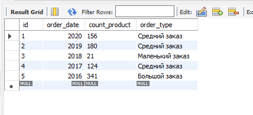
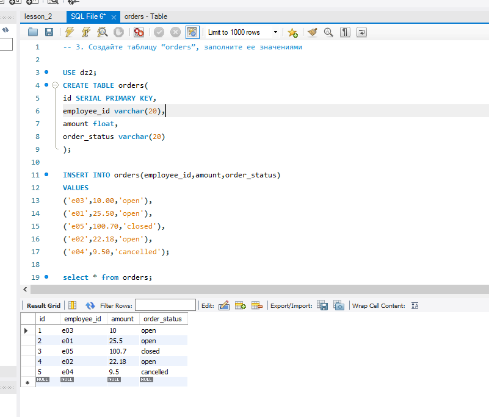

-- 1. Используя операторы языка SQL, создайте таблицу “sales”. Заполните ее данными.
-- не получилось с город, пониманию что должна быть DATA, но выдает ошибку
CREATE SCHEMA `dz2` ;
USE dz2;
CREATE TABLE sales(
id SERIAL PRIMARY KEY,
order_date YEAR NOT NULL,
count_product INT
);

/*
Для данных таблицы “sales” укажите тип заказа в зависимости от кол-ва : 
меньше 100  -    Маленький заказ
от 100 до 300 - Средний заказ
больше 300  -     Большой заказ
*/

INSERT INTO sales(order_date,count_product)
VALUES 
(2022-01-01,156),
(2022-01-02,180),
(2022-01-03,21),
(2022-01-04,124),
(2022-01-05,341);

SELECT * FROM sales;

ALTER TABLE  sales
ADD COLUMN order_type char(20);

UPDATE sales SET order_type = 'Маленький заказ' where id =  3;
UPDATE sales SET order_type = 'Средний заказ' where id =1;
UPDATE sales SET order_type = 'Средний заказ' where id =2;
UPDATE sales SET order_type = 'Средний заказ' where id =4;
UPDATE sales SET order_type = 'Большой заказ' where id = 5;

---------------------------------------------------------------------

-- 3. Создайте таблицу “orders”, заполните ее значениями

USE dz2;
CREATE TABLE orders(
id SERIAL PRIMARY KEY,
employee_id varchar(20),
amount float,
order_status varchar(20)
);

INSERT INTO orders(employee_id,amount,order_status)
VALUES 
('e03',10.00,'open'),
('e01',25.50,'open'),
('e05',100.70,'closed'),
('e02',22.18,'open'),
('e04',9.50,'cancelled');

select * from orders;

/*
Выберите все заказы. В зависимости от поля order_status выведите столбец full_order_status:
OPEN – «Order is in open state» ; CLOSED - «Order is closed»; CANCELLED -  «Order is cancelled»
*/

select id, employee_id, amount from orders where order_status = 'open';
select id, employee_id, amount from orders where order_status = 'closed';
select id, employee_id, amount from orders where order_status = 'cancelled';

/*
Чем 0 отличается от NULL?

Ноль - это числовое значение и с ним можно проводить операции

null - не представляет не какого значения и может трактоваться как значение не определено
*/
